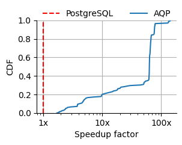
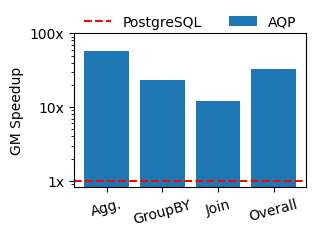

# CS598 Fall 2024 Evaluation Reproductions

Our experiments are computationally expensive and cannot be completed within
a day on a PC. Therefore, we provide the experiment log in the `data` folder.
We also provide the scripts in `speedup_analyze.ipynb` to analyze the results 
and reproduce the figures.

Please follow these steps to complete the reproduction.

**Step 1**: Prepare the python environment by running `pip install -r requirements.txt`

**Step 2**: Execute the notebook `speedup_analyze.ipynb`, you should be able to 
obtain two PDF files: `speedup_cdf.pdf` and `speedup_bar.pdf`. 

`speedup_cdf.pdf` should look the same as 

    

`speedup_bar.pdf` should look the same as

    

